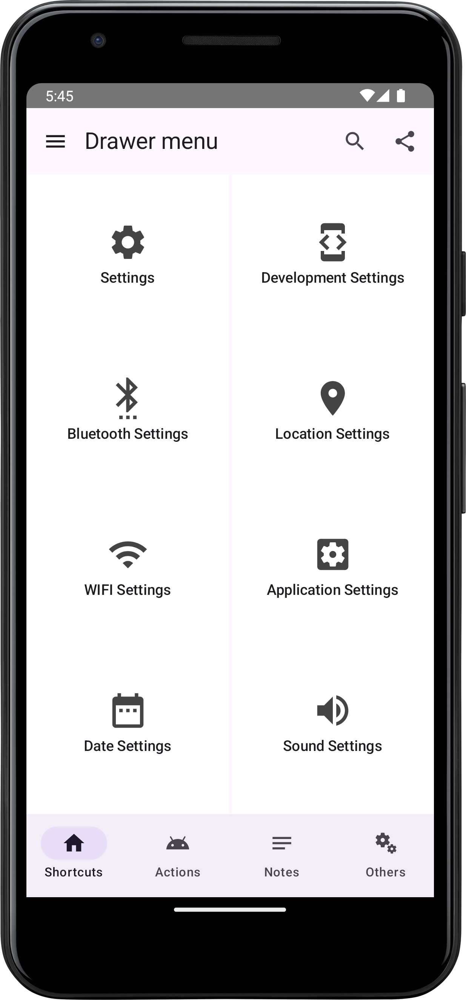
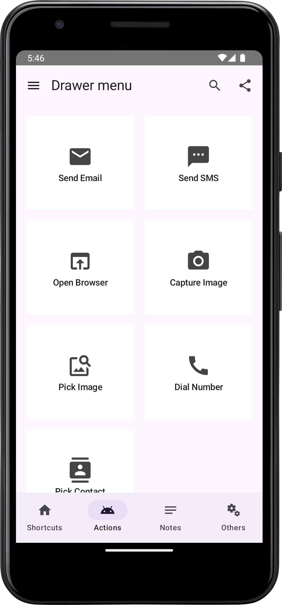
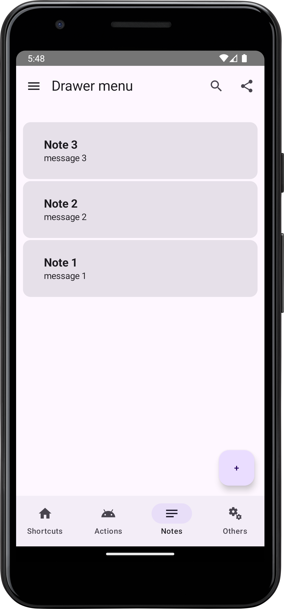
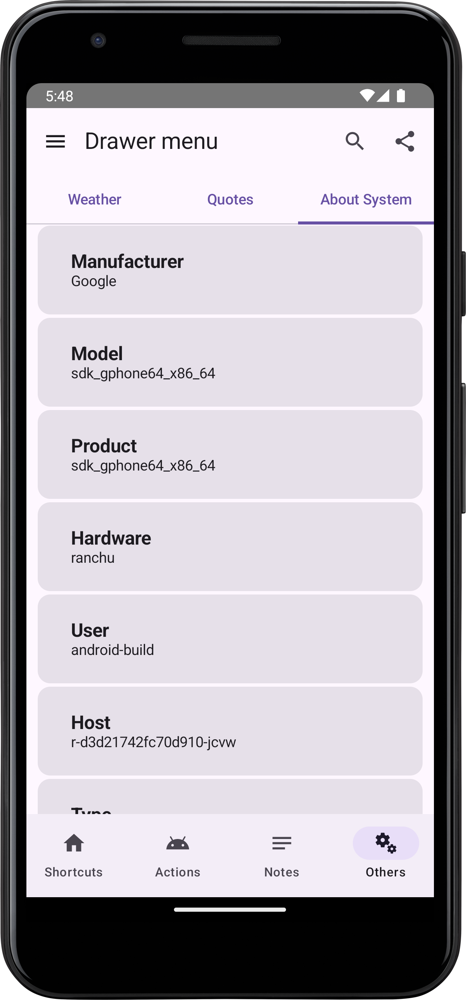

# Developer Shortcuts App

Este proyecto en progreso es una aplicación diseñada para desarrolladores, con varias pantallas que permiten gestionar atajos, acciones de intent, notas, clima, citas y mostrar información del sistema del dispositivo.

## Tabla de Contenidos

- [Developer Shortcuts App](#developer-shortcuts-app)
   - [Tabla de Contenidos](#tabla-de-contenidos)
   - [Características](#características)
      - [Pantalla de Atajos del Teléfono](#pantalla-de-atajos-del-teléfono)
      - [Pantalla de Acciones de Intent](#pantalla-de-acciones-de-intent)
      - [Pantalla de Notas](#pantalla-de-notas)
      - [Pantalla del Clima](#pantalla-del-clima)
      - [Pantalla de Citas](#pantalla-de-citas)
      - [Pantalla de Información del Sistema](#pantalla-de-información-del-sistema)
   - [Tecnologías Utilizadas](#tecnologías-utilizadas)
   - [Instalación y Ejecución](#instalación-y-ejecución)
   - [Capturas de Pantalla](#capturas-de-pantalla)

## Características

### Pantalla de Atajos del Teléfono
- Permite acceder rápidamente a funciones importantes del teléfono, facilitando un acceso eficiente a aplicaciones o configuraciones frecuentemente utilizadas.

### Pantalla de Acciones de Intent
- Proporciona una lista de acciones de intent que los usuarios pueden ejecutar, como enviar correos electrónicos o abrir aplicaciones específicas.

### Pantalla de Notas
- Permite crear, guardar y gestionar notas utilizando Room. Incluye funciones para agregar, editar y eliminar notas, con soporte para múltiples entradas.

### Pantalla del Clima
- Muestra información meteorológica actualizada para varias ciudades, con búsqueda por nombre de ciudad. Utiliza Retrofit para obtener datos del clima en tiempo real.

### Pantalla de Citas
- Ofrece citas inspiradoras para desarrolladores, obtenidas a través de una API personalizada, con navegación a detalles adicionales.

### Pantalla de Información del Sistema
- Proporciona información detallada sobre el hardware y software del dispositivo, presentada de forma clara y organizada.

## Tecnologías Utilizadas

El proyecto hace uso de las siguientes tecnologías y componentes de Android:

- **Jetpack Compose**
- **Navigation Drawer**
- **Bottom Navigation**
- **Jetpack Navigation**
- **Material Design 3**
- **ViewModel**
- **Flows**
- **Coroutines**
- **Retrofit**
- **Room**
- **Clean Architecture**

## Instalación y Ejecución

1. **Clonar el repositorio:**
   ```bash
   git clone <URL_DEL_REPOSITORIO>
   ```

2. **Ejecutar el proyecto en Android Studio:**
   - Abre el proyecto en Android Studio.
   - Conéctalo a un emulador o dispositivo físico.
   - Compila y ejecuta la aplicación.

## Capturas de Pantalla

<h3 align="center">Aquí algunas capturas de pantalla de la aplicación:</h3>

<table>
<td width="50%">
<div align="center">


<br>


</div>                                                                       
</td>                                                         
</table>